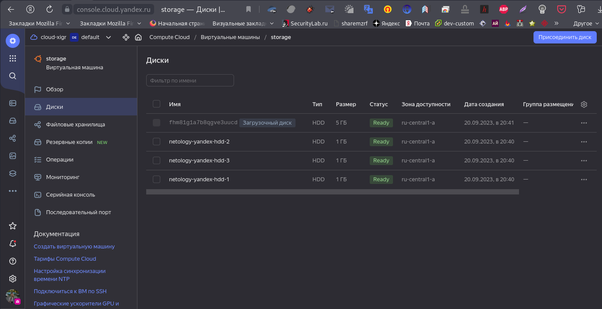

# Домашнее задание к занятию "`Управляющие конструкции в коде Terraform`" - `Соколов Александр`


### Задание 1

1. Изучите проект.
2. Заполните файл personal.auto.tfvars.
3. Инициализируйте проект, выполните код. Он выполнится, даже если доступа к preview нет.

Примечание. Если у вас не активирован preview-доступ к функционалу «Группы безопасности» в Yandex Cloud, запросите доступ у поддержки облачного провайдера. Обычно его выдают в течение 24-х часов.

Приложите скриншот входящих правил «Группы безопасности» в ЛК Yandex Cloud или скриншот отказа в предоставлении доступа к preview-версии.

------

## Ответ

Скриншот входящих правил «Группы безопасности» в ЛК Yandex Cloud


### Задание 2

1. Создайте файл count-vm.tf. Опишите в нём создание двух **одинаковых** ВМ  web-1 и web-2 (не web-0 и web-1) с минимальными параметрами, используя мета-аргумент **count loop**. Назначьте ВМ созданную в первом задании группу безопасности.(как это сделать узнайте в документации провайдера yandex/compute_instance )
2. Создайте файл for_each-vm.tf. Опишите в нём создание двух ВМ с именами "main" и "replica" **разных** по cpu/ram/disk , используя мета-аргумент **for_each loop**. Используйте для обеих ВМ одну общую переменную типа list(object({ vm_name=string, cpu=number, ram=number, disk=number  })). При желании внесите в переменную все возможные параметры.
3. ВМ из пункта 2.2 должны создаваться после создания ВМ из пункта 2.1.
4. Используйте функцию file в local-переменной для считывания ключа ~/.ssh/id_rsa.pub и его последующего использования в блоке metadata, взятому из ДЗ 2.
5. Инициализируйте проект, выполните код.

------

## Ответ

Создание и запуск виртуальных машин с именами `netology-develop-platform-web-1` и `netology-develop-platform-web-2`


Создание и запуск виртуальных машин с именами `main` и `replica`после запуска vm `netology-develop-platform-web-1` и `netology-develop-platform-web-2`


Содержание файла `for_each-vm.tf`

```
data "yandex_compute_image" "ubuntu" {
  family = var.vm_web_compute_image
}

resource "yandex_compute_instance" "example_each" {
  depends_on = [ yandex_compute_instance.example ]
  platform_id = "standard-v1"
  for_each = { for vm in local.vm_inst: "${vm.name}" => vm }
  name = each.key
  resources {
        cores           = each.value.cpu
        memory          = each.value.ram
        core_fraction   = each.value.core_fraction
  }

  boot_disk {
    initialize_params {
      image_id = data.yandex_compute_image.ubuntu.image_id
      type = "network-hdd"
      size = var.vpc_hdd
    }   
  }

  metadata = {
    ssh-keys = "ubuntu:${file("~/.ssh/id_rsa.pub")}"
  }

  scheduling_policy { preemptible = true }

  network_interface { 
    subnet_id = yandex_vpc_subnet.develop.id
    nat       = true
  }
  allow_stopping_for_update = true
}

```


### Задание 3

1. Создайте 3 одинаковых виртуальных диска размером 1 Гб с помощью ресурса yandex_compute_disk и мета-аргумента count в файле **disk_vm.tf** .
2. Создайте в том же файле **одиночную**(использовать count или for_each запрещено из-за задания №4) ВМ c именем "storage"  . Используйте блок **dynamic secondary_disk{..}** и мета-аргумент for_each для подключения созданных вами дополнительных дисков.

------

## Ответ

Содержание файла `disk_vm.tf`

```
resource "yandex_compute_disk" "vm_hdd_1gb" {
  name  = "netology-yandex-hdd-${count.index+1}"
  count = 3
  size  = 1
}

data "yandex_compute_image" "ubuntu_stor" {
  family = var.vm_web_compute_image
}
resource "yandex_compute_instance" "storage" {
  name        = "storage"
  platform_id = var.vm_platform_id
  resources {
    cores         = 2
    memory        = 1
    core_fraction = 5
  }
  boot_disk {
    initialize_params {
      image_id = data.yandex_compute_image.ubuntu.image_id
    }
  }

  dynamic "secondary_disk" {
    for_each = "${yandex_compute_disk.vm_hdd_1gb.*.id}"
    content {
      disk_id = yandex_compute_disk.vm_hdd_1gb["${secondary_disk.key}"].id
   }
  }

  scheduling_policy {
    preemptible = true
  }

  network_interface { 
    subnet_id = yandex_vpc_subnet.develop.id
    nat       = true
  }

  metadata = {
    ssh-keys = "ubuntu:${file("~/.ssh/id_rsa.pub")}"
  }
}

```

`Storage` с подключенными 4-мя дисками




### Задание 4

1. В файле ansible.tf создайте inventory-файл для ansible.
Используйте функцию tepmplatefile и файл-шаблон для создания ansible inventory-файла из лекции.
Готовый код возьмите из демонстрации к лекции [**demonstration2**](https://github.com/netology-code/ter-homeworks/tree/main/03/demonstration2).
Передайте в него в качестве переменных группы виртуальных машин из задания 2.1, 2.2 и 3.2, т. е. 5 ВМ.
2. Инвентарь должен содержать 3 группы [webservers], [databases], [storage] и быть динамическим, т. е. обработать как группу из 2-х ВМ, так и 999 ВМ.
4. Выполните код. Приложите скриншот получившегося файла. 

Для общего зачёта создайте в вашем GitHub-репозитории новую ветку terraform-03. Закоммитьте в эту ветку свой финальный код проекта, пришлите ссылку на коммит.   
**Удалите все созданные ресурсы**.

------

## Ответ


Yndex.Cloud с IP-адресами


Скришот получившегося файла `Inventory` для `ansible`

